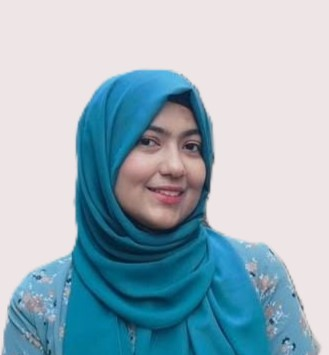

  

  # Hafiza Hajrah Rehman
  
<strong>Data Analyst | Data Scientist | AI Security & Interpretability Specialist | GenAI Enthusiast</strong>

  
📍 <strong>M.Sc. Data Science & AI @ Saarland University, Germany 🇩🇪</strong> | <strong>B.Sc. Computer Science @ UCP, Pakistan 🇵🇰</strong>

  
  
  

   
  

---

## 📌 Quick Nav
- [👋 About Me](#-about-me)
- [🎓 Education](#-education)
- [💼 Professional Experience](#-professional-experience)
- [🚀 Featured Projects](#-featured-projects)
- [📁 Archived Projects](#-archived--conceptual-projects)
- [🏆 Achievements & Certifications](#-achievements--certifications)
- [🤝 Leadership](#-leadership--volunteering)
- [🛠️ Skills](#-technical-skills)
- [🌍 Languages](#-languages)
- [📬 Connect](#-lets-connect)

---

## 👋 About Me
I'm Hafiza Hajrah Rehman, a dedicated **Data Scientist and AI Researcher** passionate about crafting **trustworthy, interpretable, and secure AI systems**. Currently pursuing my Master's in Data Science and Artificial Intelligence at Saarland University, Germany, I blend rigorous theory with practical innovation in areas like adversarial machine learning, explainable AI (XAI), and efficient LLM fine-tuning.

From my roots in Pakistan to thriving in Germany's tech ecosystem, I excel at turning complex data into ethical, impactful solutions—whether hardening models against attacks, visualizing "what models see," or optimizing for low-resource domains like healthcare and IoT. As a mentor and community leader, I believe in accessible AI that empowers everyone.

> *"I believe in code that works, reports that explain, and models that can be trusted."*

Fluent in English, building German fluency, and always open to collaborations in **AI Research, ML Engineering, or Trustworthy AI** (with a secret NASA dream 🚀). Let's innovate responsibly!

---

## 🎓 Education

### M.Sc. Data Science and Artificial Intelligence  
**Saarland University**, Saarbrücken, Germany  
*March 2024 – March 2026 (Expected)*  
- **Key Courses**: Machine Learning, Neural Networks: Theory and Implementation, Generative AI, Statistical NLP, Advances in AI for Autonomous Driving, German as a Foreign Language A1  

### B.Sc. Computer Science (Honors)  
**University of Central Punjab**, Lahore, Pakistan  
*December 2019 – July 2023*  
- **Final Year Project**: Deep Learning for Pedestrian Danger Estimation (3rd Place in University Competition)  
- **Relevant Coursework**: Artificial Intelligence, Data Analysis Techniques, Mathematics for Machine Learning, Introduction to Data Science  

---

## 💼 Professional Experience

### ML/Data Analyst  
**Zeeoutsourcing UK** (Remote)  
*November 2022 – February 2024*  
- Contributed to ongoing AI research projects focused on IoT security and energy-efficient intrusion detection.  
- Worked on the development of SFlexCrypt, a framework for detecting Sinkhole attacks in wireless sensor networks using machine learning.  
- Performed data preprocessing, model training, and evaluation on the Contiki-Cooja dataset to improve detection accuracy and energy efficiency.  
- Collaborated with the research team to analyze results and support publications on IoT-based security and power optimization in smart city applications.  

### AI Engineering Intern  
**Zeeoutsourcing UK** (Remote)  
*August 2022 – October 2022*  
- Assisted in ML model development for IoT applications, focusing on performance tuning and evaluation.  
- Contributed to literature review and data preparation for energy-efficient IoT systems.  
- Assisted in documentation, result visualization, and report preparation for research publications.  

---

## 🚀 Featured Projects

Dive into my hands-on work in AI security, interpretability, and healthcare. Each project includes code, demos, and insights—fork away!

| Project | Description | Tech Stack | Links |
|---------|-------------|------------|-------|
| **🔐 Membership Inference Attack (MIA) on ResNet18** *Evaluating Privacy Leakage in Pretrained Models* | Shadow model training + attack classifier to detect training set membership. >80% success on CIFAR-10 subset, spotlighting privacy risks. | PyTorch, CIFAR-10, Adversarial ML |  |
| **🕵️ Model Stealing via Mock API** *Reverse-Engineering a Protected Encoder* | Black-box extraction with query synthesis + fine-tuning; replicated model with <5% accuracy loss, exposing API flaws. | PyTorch, Transfer Learning, API Security |  |
| **🛡️ Robust Adversarial Training for CIFAR-10** *Building Models That Survive Attacks* | FGSM/PGD hardening on ResNet18: 0% → 48% robust accuracy under PGD, 78% clean—balancing defense & generalization. | PyTorch, FGSM, PGD, Model Defense |  |
| **🧾 Interpretability of ResNet using Grad-CAM & Network Dissection** *What Does Your Model Actually “See”?* | Neuron activation mapping on ImageNet/Places365; Grad-CAM/LIME visuals for transparent decisions in critical apps. | XAI, Grad-CAM, LIME, OpenCV |  |
| **🧪 Fine-tuning Chemical LLMs with LoRA & Influence Sampling** *Parameter-Efficient Learning for Scientific Domains* | LoRA/BitFit/iA3 comparison on chemical datasets; LoRA excelled in stability with influence sampling. | Hugging Face, LoRA, PyTorch |  |
| **🏥 Medical Expense Prediction with XGBoost & SMOTE** *Healthcare Analytics with Real-World Impact* | End-to-end pipeline: R²=0.89 regression, F1=0.92 classification; SMOTE tackled imbalance. | XGBoost, Scikit-learn, Pandas |  |
| **🩻 Label-Efficient Tumor Detection using SimCLR + Grad-CAM** *Self-Supervised Learning for Medical Anomaly Detection* | SimCLR on 5,600 unlabeled X-rays; fine-tuned for tumors (AUC=0.65 vs. 0.58 baseline), ~70% annotation savings. Grad-CAM aligned with expert marks. | SimCLR, PyTorch, Grad-CAM |  |
| **🚶 Pedestrian Detection with Danger Estimation** *Real-Time Risk Assessment from Surveillance* | DL model for pedestrian spotting + dynamic "danger zones" via distance/bounding boxes. 3rd Place in UCP FYP (120+ entries). | Python, OpenCV, PyTorch |  |

---

## 📁 Archived & Conceptual Projects

- **🌐 SFlexCrypt — Sinkhole Attack Detection in IoT Networks**  
  Energy-efficient ML framework for wireless sensor networks (Contiki-Cooja).  
  *Skills*: Python, Scikit-learn, IoT Security  

- **🏙️ Low-Power IoT Challenges in Smart Cities**  
  Research on optimized data transmission for urban IoT.  
  *Skills*: IoT Analytics, Power Optimization  

- **🤖 Intellivision — AI Content Creation & Video Lecture Generator** *(FICS NUST 2023 Finalist)*  
  GPT-3 + Synthesia web app for auto-lectures.  
  *Skills*: GPT-3, NLP, Flask, EdTech AI  

- **💬 Conversational AI Help-Desk Bot**  
  Intent-based university chatbot; cut manual queries by 60%.  
  *Skills*: Python, Dialogflow, NLP  

- **🧠 Explainable AI for Medical Diagnosis**  
  LIME/SHAP/counterfactuals for transparent healthcare models.  
  *Skills*: XAI, SHAP, Ethical AI  

- **🧮 Research Collaboration — NUCES-FAST Lahore**  
  Automata theory, mathematical computing + ML integration.  
  *Skills*: Theoretical CS, Automata  

---

## 🏆 Achievements & Certifications

### Achievements
- 🥉 **3rd Place** — UCP FYP Competition (2023) for Pedestrian Detection  
- 🧩 **Selected Project** — FICS NUST 2023 (*Intellivision*)  
- 📊 **Research Contribution** — SFlexCrypt in IoT security @ Zeeoutsourcing UK (2023)  
- 🔬 **Collaboration** — With Prof. Liaqat Majeed on Automata/ML (2022)  
- 💡 **Samsung Innovation Campus AI Cohort-II Graduate** (2022)  

### Certifications
- ☁️ **AWS Academy Machine Learning Foundations** — Graduate  
- ☁️ **AWS Academy Data Engineering** — Graduate  
- ☁️ **AWS Academy Natural Language Processing** — Graduate  
- 🎓 **Artificial Intelligence Course (SIC Cohort-II)** — Samsung  

📄 [Download CV (PDF)](https://github.com/hajraRehman/hajraRehman.github.io/blob/main/Rehman_HafizaHajrah_CV.pdf)

---

## 🤝 Leadership & Volunteering

- **President — Pakistan Student Association Saarland**  
  Led academic, cultural, and community initiatives for Pakistani students at Saarland University.  

- **ML Instructor — LIVEX–UMT** (Volunteer)  
  Taught foundational and applied concepts in Machine Learning to undergraduate students.  

- **Al-Khidmat Foundation | Volunteer**  
  Participated in plantation and ration drives, contributing to local community welfare (2023).  

- **TAAKRA’23 | Management Head**  
  Coordinated logistics and management for Pakistan’s largest multi-category inter-university competition.  

- **UCP Literary & Engineering Societies | Director Linguistics & Writer’s Group**  
  Mentored teams in creative and technical writing; organized inter-departmental literary workshops and competitions.  

---

## 🛠️ Technical Skills

### Programming Languages
     

### Frameworks & Libraries
- **ML/DL**: PyTorch, Scikit-learn, XGBoost, TensorFlow, LoRA, iA3  
- **NLP/GenAI**: Hugging Face, Transformers, Prompt Engineering  
- **Data Viz**: Matplotlib, Seaborn, Tableau  
- **Web/Other**: React.js, Django, HTML/CSS, OpenCV  

### Techniques & Tools
- **ML Techniques**: Supervised/Unsupervised, SMOTE, Grad-CAM, LIME, SimCLR  
- **Data Analysis**: Pandas, NumPy, EDA, Feature Engineering  
- **Cloud/DevOps**: AWS (SageMaker, S3, EC2), Git, Docker, Jupyter  
- **Domains**: AI Security, Trustworthy AI, Computer Vision, NLP, Generative AI, Healthcare, Autonomous Driving  

---

## 🌍 Languages
- **English** (Fluent) 🇬🇧  
- **German** (Intermediate) 🇩🇪  
- **Urdu** (Native) 🇵🇰  
- **Punjabi** (Native) 🇵🇰  
- **Arabic** (Basic) 🇸🇦  

---
## 📬 Let’s Connect
I'm open to collaborations and opportunities in **Data Science, ML Engineering, AI Research, or AI Security**. Let's chat about AI projects, ethics, or innovations—feel free to reach out!  

 
 

---
*Last Updated: October 27, 2025*  

  
    

